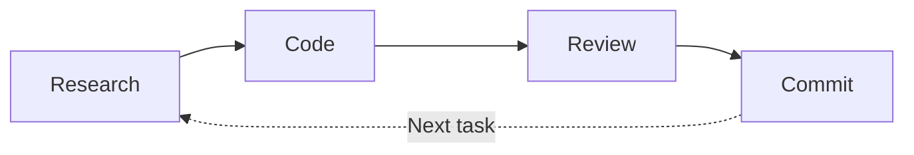

# Spellcaster

**Stop coding in circles. Start shipping.**

Most AI coding sessions look the same: you prompt, it codes, something breaks, you prompt again. Repeat until frustrated.

Spellcaster is different. It's a structured workflow for [Claude Code](https://claude.ai/claude-code) that thinks before it builds, tracks what it's doing, and asks before it acts.

Two tools. One workflow. Code that actually works.

---

## The Problem

You have an idea. You ask an AI to build it. Three hours later:
- Files scattered everywhere
- Half-finished features
- No idea what changed or why
- "Let me start over" becoming your catchphrase

Sound familiar?

## The Solution


**Spellcaster** gives AI-assisted coding something it desperately needs: structure.

---

## How It Works

### Two Phases, One Workflow

```mermaid
flowchart TB
    subgraph phase1 ["Phase 1: PLAN"]
        A["Your idea"] --> B["Claude-Codex Planner"]
        B --> C["Claude + Codex dialogue"]
        C --> D["Challenged assumptions"]
        D --> E["Validated architecture"]
    end

    subgraph phase2 ["Phase 2: BUILD"]
        E --> F["Spellcaster breaks it into tasks"]
        F --> G["Beads tracks everything"]
        G --> H["RALPH Loop executes"]
        H --> I["Working software"]
    end

    style phase1 fill:#1a1a2e
    style phase2 fill:#16213e
```



### Phase 1: Plan with Claude-Codex Planner

Before writing a single line of code, get two AI perspectives on your approach.

**Claude** and **OpenAI Codex** engage in structured dialogue:
- Challenge your assumptions
- Explore tradeoffs
- Identify risks you hadn't considered
- Produce a battle-tested plan

This isn't a rubber stamp. It's a stress test.

### Phase 2: Build with Spellcaster

Now execute. Spellcaster breaks your plan into an **Epic** (the big picture) and **Tasks** (the steps to get there).

Each task runs through the **RALPH Loop**:



| Phase | What Happens | Who Does It |
|-------|--------------|-------------|
| **Research** | Understand best practices before coding | Opus |
| **Code** | Implement the feature | Sonnet |
| **Review** | Run tests, check quality | Sonnet or Codex |
| **Commit** | Save with clear message | Sonnet |

Repeat until Epic complete. Then ask: continue or stop?

### The System of Record: Beads

Every task lives in **Beads** — your single source of truth.

```bash
bd ready          # What can I work on?
bd show task-1    # Show me the details
bd list           # Everything at a glance
```

No more "wait, what was I doing?" moments.

---

## What Progress Looks Like

While Spellcaster works, you see exactly what's happening:

### Quick Status
```
Phase: Code
Task: Implementing user authentication
Progress: 45K / 200K tokens (22%)
Next: Review phase
```

### Full Progress Table
```markdown
## Epic: User Authentication

| ID | Task | Phase | Status | Notes |
|----|------|-------|--------|-------|
| bd-a1.1 | Auth research | Research | Complete | JWT recommended |
| bd-a1.2 | Implement auth | Code | In Progress | Writing middleware |
| bd-a1.3 | Test auth | Review | Pending | Blocked |
| bd-a1.4 | Commit auth | Commit | Pending | Blocked |
```

### When an Epic Completes
```markdown
## Epic Complete: User Authentication

| Task | Status | Notes |
|------|--------|-------|
| Research | Done | Found 3 patterns |
| Implement | Done | 4 files modified |
| Review | Done | All tests pass |
| Commit | Done | Hash: abc123 |

Commits: 1 (local)

Options:
1. Continue to next Epic
2. Push to remote
3. Stop here
```

You're always in control. Nothing ships without your say-so.

---

## Installation

### Prerequisites

- [Claude Code](https://claude.ai/claude-code) installed
- A project to work on

### Step 1: Get Spellcaster

```bash
# Clone into your project's .claude directory
git clone https://github.com/[your-repo]/spellcaster.git
cp -r spellcaster/skills your-project/.claude/
cp -r spellcaster/agents your-project/.claude/
```

Your project should look like:
```
your-project/
├── .claude/
│   ├── skills/
│   │   └── SKILL.md
│   └── agents/
│       └── claude-codex-planner.md
├── src/
└── ...
```

### Step 2: Install Beads (Task Tracking)

```bash
npm install -g @beadorg/bd
# OR
cargo install bd

# Initialize in your project
cd your-project
bd onboard
```

### Step 3 (Optional): Enable Codex Reviews

For multi-AI code reviews:

```bash
# Install Codex CLI
npm install -g @openai/codex

# Set your API key
export OPENAI_API_KEY="sk-..."
```

Not required — Spellcaster works great with just Claude.

---

## Usage

### Planning Phase

Start Claude Code in your project, then:

```
You: I want to build a real-time notification system.
     Can we plan this with claude-codex-planner?

Claude: [Launches multi-AI dialogue]
        [Claude and Codex debate approaches]
        [Produces validated architecture]
```

### Building Phase

```
You: /spellcaster

Claude: === Spellcaster Session Setup ===

        Reviewer: Sonnet (or Codex if configured)

        What would you like to build?

You: Implement the notification system we just planned

Claude: Creating Epic and tasks in Beads...
        - bd-a1: Real-time Notifications (Epic)
        - bd-a1.1: Research WebSocket patterns
        - bd-a1.2: Implement notification service
        - bd-a1.3: Review and test
        - bd-a1.4: Commit

        Starting RALPH Loop...

        === Research Phase ===
        [Explores codebase, identifies patterns]

        === Code Phase ===
        [Implements based on research]

        === Review Phase ===
        [Runs tests, checks quality]

        === Commit Phase ===
        [Saves work with clear message]

        Task complete. Moving to next...
```

---

## When to Use What

| Situation | Tool |
|-----------|------|
| "I have a vague idea" | Claude-Codex Planner |
| "I need to evaluate approaches" | Claude-Codex Planner |
| "I know what to build, let's go" | Spellcaster |
| "Complex architecture decision" | Planner then Spellcaster |
| "Quick feature add" | Spellcaster directly |

---

## The Philosophy

> **Code Quality > User Happiness**

Spellcaster will push back if you ask for something that violates best practices. Not to annoy you — to protect you from future pain.

It explains the tradeoff. You decide. But you decide *informed*.

---

## FAQ

**Do I need to know how to code?**
Basic familiarity helps. But Spellcaster handles the technical execution — you focus on *what* you want, not *how* to build it.

**What if it makes a mistake?**
Every phase has checkpoints. Review catches issues before commit. You approve before anything ships.

**Can I stop mid-Epic?**
Yes. Progress saves to Beads. Pick up exactly where you left off.

**Why two AIs in the planning phase?**
Different models have different blind spots. Claude and Codex challenging each other catches issues neither would find alone.

**Is Codex required?**
No. Spellcaster works fully with just Claude. Codex adds an optional second perspective.

---

## Quick Reference

```bash
# Beads commands
bd ready              # Show unblocked tasks
bd show <id>          # Task details
bd list               # All tasks
bd update <id> --status complete

# Start Spellcaster
/spellcaster

# Start planning
"Let's plan this with claude-codex-planner"
```

---

## License

MIT — Use freely, modify as needed, build something great.

---

*Stop prompting in circles. Start shipping.*
