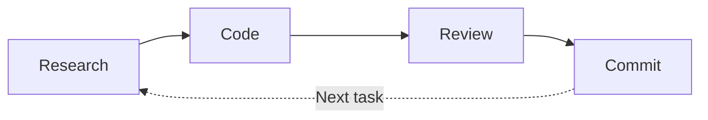

# Spellcaster

A structured workflow for AI-assisted coding that thinks before it builds, tracks what it's doing, and asks before it acts.

## Quick Start

```bash
# Clone the repo
git clone https://github.com/rachit-j/spellcaster.git

# Copy into your project's .claude directory
cp -r spellcaster/skills your-project/.claude/
cp -r spellcaster/agents your-project/.claude/
```

Your project should look like:
```
your-project/
├── .claude/
│   ├── skills/
│   │   └── SKILL.md
│   └── agents/
│       └── claude-codex-planner.md
├── src/
└── ...
```

## Compatibility

Developed for [Claude Code](https://claude.ai/claude-code), but works with any AI coding agent that has access to Claude LLM:

- Cursor Agent
- Cline
- Amp
- Clawd
- GitHub Copilot CLI

## What's Included

### Skill: Spellcaster (`skills/SKILL.md`)

Executes the RALPH Loop - a structured build workflow that breaks your project into Epics and Tasks, then iterates through Research, Code, Review, and Commit phases.

### Agent: Claude-Codex Planner (`agents/claude-codex-planner.md`)

Multi-AI planning that pairs Claude with OpenAI Codex in structured dialogue. They challenge assumptions, explore tradeoffs, and produce validated architecture before you write any code.

## How It Works

### Two Phases, One Workflow

```mermaid
flowchart TB
    subgraph phase1 ["Phase 1: PLAN"]
        A["Your idea"] --> B["Claude-Codex Planner"]
        B --> C["Claude + Codex dialogue"]
        C --> D["Challenged assumptions"]
        D --> E["Validated architecture"]
    end

    subgraph phase2 ["Phase 2: BUILD"]
        E --> F["Spellcaster breaks it into tasks"]
        F --> G["Beads tracks everything"]
        G --> H["RALPH Loop executes"]
        H --> I["Working software"]
    end

    style phase1 fill:#1a1a2e
    style phase2 fill:#16213e
```



### The RALPH Loop

Each task runs through four phases:



| Phase | What Happens | Who Does It |
|-------|--------------|-------------|
| **Research** | Understand best practices before coding | Opus |
| **Code** | Implement the feature | Sonnet |
| **Review** | Run tests, check quality | Sonnet or Codex |
| **Commit** | Save with clear message | Sonnet |

Repeat until Epic complete. Then ask: continue or stop?

### Task Tracking with Beads

Every task lives in **Beads** — your single source of truth.

```bash
bd ready          # What can I work on?
bd show task-1    # Show me the details
bd list           # Everything at a glance
```

## Installation

### Prerequisites

- [Claude Code](https://claude.ai/claude-code) installed (or compatible agent)
- A project to work on

### Step 1: Get Spellcaster

```bash
git clone https://github.com/rachit-j/spellcaster.git
cp -r spellcaster/skills your-project/.claude/
cp -r spellcaster/agents your-project/.claude/
```

### Step 2: Install Beads (Task Tracking)

```bash
npm install -g @beadorg/bd
# OR
cargo install bd

# Initialize in your project
cd your-project
bd onboard
```

### Step 3 (Optional): Enable Codex Reviews

For multi-AI code reviews:

```bash
# Install Codex CLI
npm install -g @openai/codex

# Set your API key
export OPENAI_API_KEY="sk-..."
```

Not required — Spellcaster works great with just Claude.

## Usage

### Planning Phase

Start Claude Code in your project, then:

```
You: I want to build a real-time notification system.
     Can we plan this with claude-codex-planner?

Claude: [Launches multi-AI dialogue]
        [Claude and Codex debate approaches]
        [Produces validated architecture]
```

### Building Phase

```
You: /spellcaster

Claude: === Spellcaster Session Setup ===

        What would you like to build?

You: Implement the notification system we just planned

Claude: Creating Epic and tasks in Beads...
        Starting RALPH Loop...

        === Research Phase ===
        [Explores codebase, identifies patterns]

        === Code Phase ===
        [Implements based on research]

        === Review Phase ===
        [Runs tests, checks quality]

        === Commit Phase ===
        [Saves work with clear message]

        Task complete. Moving to next...
```

### Quick Reference

```bash
# Beads commands
bd ready              # Show unblocked tasks
bd show <id>          # Task details
bd list               # All tasks
bd update <id> --status complete

# Start Spellcaster
/spellcaster

# Start planning
"Let's plan this with claude-codex-planner"
```

## License

MIT
